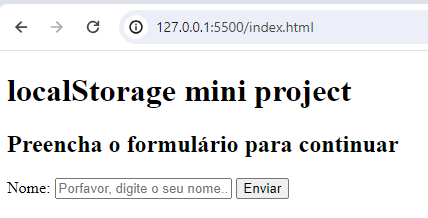

# 
  LocalStorage Mini Project 

## Pourpose

This is just a mini project to exercise how to work with localstorage in the browser. 

The purpose of this project is ask the user's name and save it to localStorage so that the user can close the browser window and be logged in when open it again. 

The user can log out by clicking on "Sair" button. Through this action the username saved in the localStorage is removed. 

It was also exercised how to manipulate DOM elements,as DOM elements shown in the screen are differente depeding on whether the user is logged in or not. 

    
    
Image 1: Screen to log in to the system

 
 

    
 
Image 2: Screen after logging in to the system

